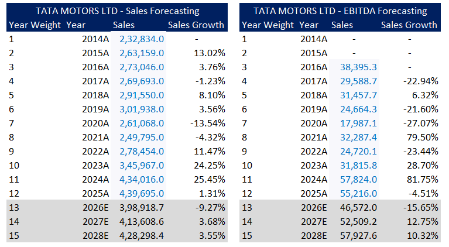

# 📊 Tata Motors Financial Modelling & Analysis

## 🎯 Project Objective
This project focuses on building a financial model for Tata Motors to analyze company performance, evaluate financial health, and forecast future trends.  
The analysis combines financial statement review, forecasting, and ratio analysis to support data-driven financial decision-making.

---

## 🛠 Tools Used
- Excel (Financial Modelling)
- Financial Statement Analysis
- Forecasting Techniques
- Ratio Analysis

---

## 📂 Project Workflow
1. Historical financial statement analysis  
2. Sales forecasting based on historical trends  
3. EBITDA forecasting and growth analysis  
4. Profitability and margin analysis  
5. Financial ratio analysis  
6. Cash flow analysis  

---

## 📈 Sales & EBITDA Forecasting
Forecasting was performed using historical company performance to estimate future sales and EBITDA growth trends.

### Forecasting Preview

---

## 📊 Financial Statement Analysis
The model includes structured analysis of:

- Income Statement  
- Balance Sheet  
- Cash Flow Statement  

This helps evaluate company performance, profitability, and financial stability over time.

---

## 🔎 Key Financial Analysis Performed
- Sales growth analysis  
- EBITDA trend analysis  
- Profitability analysis  
- Financial ratio analysis  
- Cash flow trend evaluation  
- Forecast modelling  

---

## 📁 Financial Model File
Download the complete Excel financial model:

[Download Financial Model](tata_motors.xlsx)

---

## 💼 Business Impact
This financial model helps:

- Understand company financial performance  
- Identify growth and profitability trends  
- Support financial planning and analysis  
- Enable data-driven decision-making  

---

## 🚀 Key Skills Demonstrated
- Financial Modelling
- Forecasting
- Financial Statement Analysis
- Ratio Analysis
- Financial Performance Evaluation
